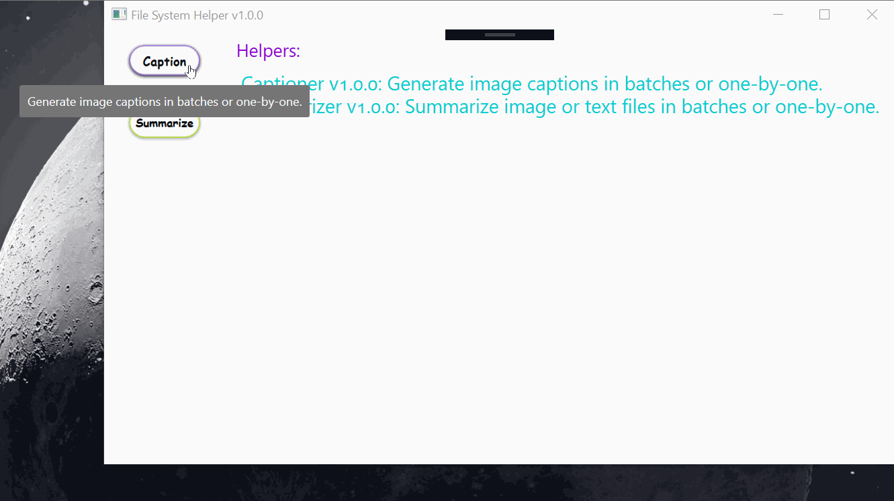

# File System Helper #
Extensible application to help with file system tasks such as test summarization and image captioning.

## FSH.NET6 Branch Updates ##
- Project migrated to .NET 6.
- Image-captioner model served using Flask.

Deploy server locally in Docker container:
```bash
$ docker build --pull --rm -f "Dockerfile" -t tensorflow/tensorflow:icmserver-gpu "."
$ docker run --rm -it --network=host --gpus all \
    --mount type=bind,source=/path/to/data/train2014,target=/tmp/icmserver/data/train2014,readonly \
    tensorflow/tensorflow:icmserver-gpu
```
Training data should be located on host if using --mount/bind.

Serve model from container:
```bash
$ python icmserver.py --serve
```
Generate captions from the FSH ImageCaptioner plugin.


